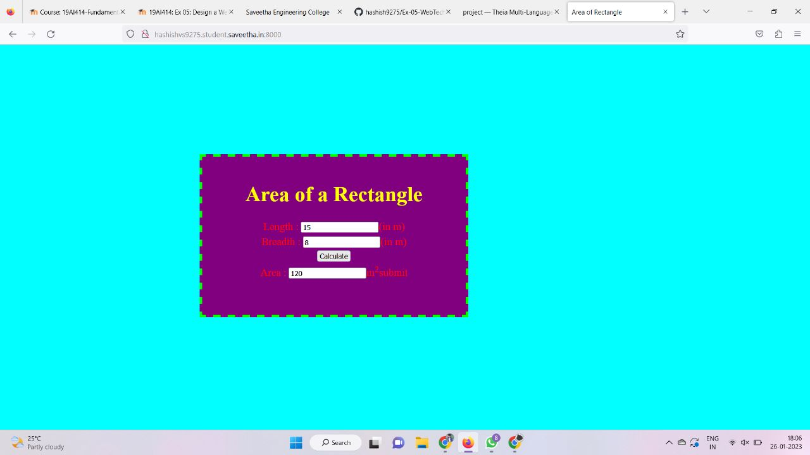

# Design a Website for Server Side Processing

# AIM:

To design a website to perform mathematical calculations in server side.

# Step 1:
Clone the repository from Github.

# Step 2:
Creat Django Admin project.

# Step 3:
Create a New app.

# Step 4:
Create python programs for viwes and urls.

# Step 5:
Create a HTML file of forms

# Step 6:
Publish the website in the given URL.

## PROGRAM :
```
<!DOCTYPE html>
<html>
<head>
    <meta charset='utf-8'>
    <meta http-equiv='X-UA-Compatible' content='IE=edge'>
    <title>Area of Rectangle</title>
    <meta name='viewport' content='width=device-width, initial-scale=1'>
    <link rel='stylesheet' type='text/css' media='screen' href='main.css'>
    <script src='main.js'></script>
</head>
<style>
    *{
        box-sizing: border-box;
        font-family:Arial, Helvetica, sans-serif ;
    }
    body{
        background-color:rebeccapurple;
    }
    .container{
    width: 1080px;
    height: 500px;
    margin-top: 100px;
    margin-left: auto;
    margin-right: auto;
    border-radius: 10px;
    border: 10px solid rgb(72, 0, 87);
    background-color:rgb(175, 93, 223);
    }
    h1{
        text-align: center;
        padding-top: 20px;
    }
    .calculate{
        padding-top: 10px;
        padding-bottom: 10px;
        padding-left: 10px;
        padding-right:10px;
        text-align: center;
        font-size: 20px;
    }
    .footer {
  display: block;
  width: 100%;
  height: 40px;
  background-color: rgb(72,0,87);
  text-align: center;
  padding-top: 10px;
  padding-right: 5px;
  margin-right: 15px;
  margin-bottom: 20px;
  color: white;
  margin-top: 150px;
}
</style>
<body>
    <div class="container">
<h1>Area Of Rectangle</h1>   
<form method ="POST">
    
    <div class="calculate"> 
Length=<input type="text" name="length" value="{{l}}"></input></br>
    </div>
    <div class="calculate"> 
Breadth=<input type="text" name="breadth" value="{{b}}"></input></br>
    </div>
    <div class="calculate"> 
<input type="submit" value="calculationarea"></input></br>
    </div>
    <div class="calculate"> 
area=<input type="text" name="area" value="{{area}}"></input></br>
    </div>
    <br>
    <div class="footer">
        Developed by Midhun Ar Prabhu 22008311
    </div>
</form>
</body>
</html>

VIEWS.PY :
from django.shortcuts import render

# Create your views here.
def areacalculation(request):
    context = {}
    context["area"] = "0"
    context["l"] = "0"
    context["b"] = "0"
    if request.method == 'POST':
        l= request.POST.get('length','0')
        b= request.POST.get('breadth','0')
        area = int(l) * int(b)
        context["area"] = area
        context["l"] = l
        context["b"] = b

    return render(request,'myapp/area.html',context)
URLS.PY :
from django.shortcuts import render

# Create your views here.
def areacalculation(request):
    context = {}
    context["area"] = "0"
    context["l"] = "0"
    context["b"] = "0"
    if request.method == 'POST':
        l= request.POST.get('length','0')
        b= request.POST.get('breadth','0')
        area = int(l) * int(b)
        context["area"] = area
        context["l"] = l
        context["b"] = b

    return render(request,'myapp/area.html',context)
```

# OUTPUT:

# RESULT:

The program is executed succesfully
